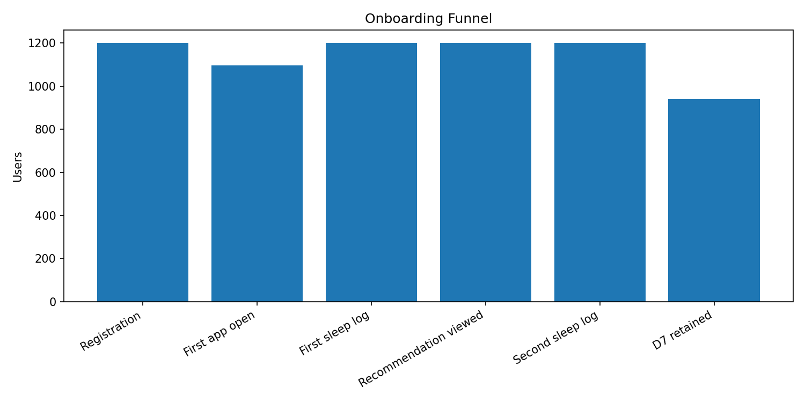
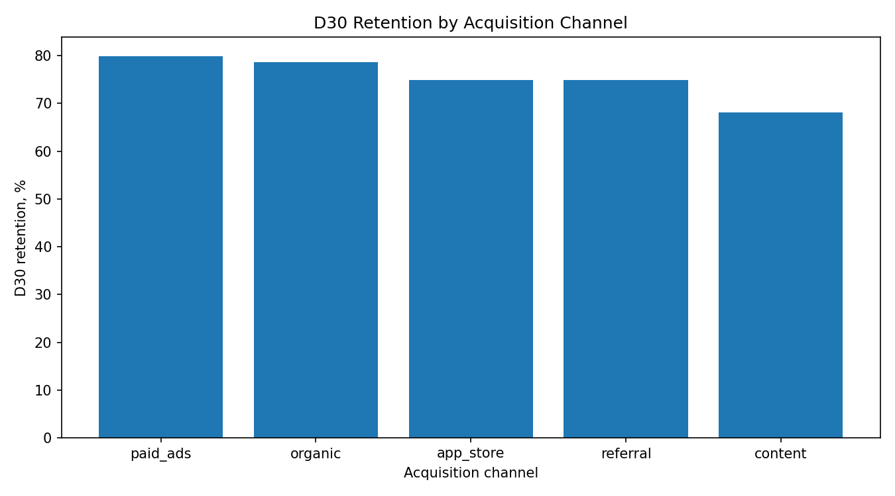
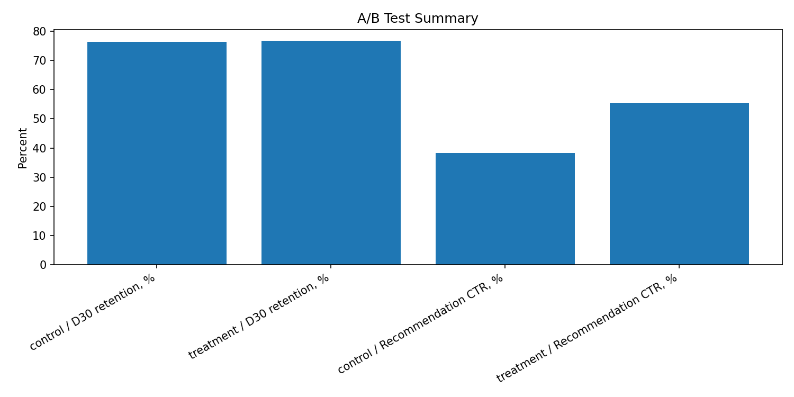

# SleepMind SQL Product Analytics

[](https://github.com/kva99kva-eng/sleepmind-sql-product-analytics/actions/workflows/tests.yml)

SQL portfolio project for a synthetic sleep-tracking healthtech app.

This project simulates the work of a product/research analyst: designing a PostgreSQL analytics database, generating event-level data, validating data quality, analyzing onboarding, retention, sleep improvement, A/B test results and churn risk.

## Executive Summary

This project is a SQL product analytics case study for a simulated sleep-tracking app.

I designed a PostgreSQL analytics database, generated synthetic event-level product data, and analyzed the full user journey: onboarding, retention, sleep improvement, A/B testing and churn risk.

The strongest part of the project is not only the SQL queries, but the business interpretation: the analysis separates engagement improvements from retention impact and avoids overstating the A/B test result.

Key analytical decisions:

- used cohort-based retention instead of simple activity counts;
- compared recommendation CTR with downstream D30 retention;
- measured sleep improvement using baseline and follow-up periods;
- built churn-risk segmentation from behavioral and subscription signals;
- clearly separated statistically weak retention lift from strong engagement lift.

## Business question

Which user behaviors are associated with better retention, stronger engagement and sleep improvement?

## Project context

SleepMind is a simulated sleep-tracking app where users can:

- log sleep sessions;
- view sleep recommendations;
- interact with personalized or generic recommendations;
- start a trial subscription;
- convert to a paid plan.

The project uses synthetic data generated with Python and loaded into PostgreSQL.

## Database tables

The database contains six core tables:

| Table | Description |
|---|---|
| `users` | User signup date, country, device and acquisition channel |
| `app_events` | Product events: app opens, sleep logs, recommendation views, diary opens |
| `sleep_sessions` | Sleep duration, efficiency, awakenings and sleep score |
| `recommendations` | Recommendation type, mode and click behavior |
| `subscriptions` | Trial, paid and cancellation status |
| `experiment_assignments` | A/B test group assignment |

## Analysis modules

| File | Analysis |
|---|---|
| `02_data_quality_checks.sql` | Data quality validation |
| `03_onboarding_funnel.sql` | Onboarding funnel |
| `04_cohort_retention.sql` | Cohort retention |
| `05_sleep_improvement.sql` | Sleep-score improvement |
| `06_ab_test_analysis.sql` | A/B test analysis |
| `07_churn_risk.sql` | Churn-risk segmentation |

## Key findings

### 1. Onboarding funnel



The largest early drop-off happens between registration and first app open.

| Funnel step | Users | Conversion from registration |
|---|---:|---:|
| Registration | 1,200 | 100.00% |
| First app open | 1,095 | 91.25% |
| First sleep log | 1,095 | 91.25% |
| First recommendation viewed | 1,095 | 91.25% |
| Second sleep log | 1,095 | 91.25% |
| D7 retained | 855 | 71.25% |

### 2. Cohort retention



Average retention:

| Metric | Retention |
|---|---:|
| D1 retention | 76.92% |
| D7 retention | 78.33% |
| D14 retention | 76.58% |
| D30 retention | 76.58% |

Retention by device was almost identical, while acquisition channel showed stronger differences.

Best D30 retention:

| Acquisition channel | D30 retention |
|---|---:|
| paid_ads | 79.87% |
| organic | 78.65% |

Weakest D30 retention:

| Acquisition channel | D30 retention |
|---|---:|
| content | 68.14% |

### 3. Sleep improvement

Sleep improvement was measured as the difference between:

- baseline period: days 0-6 after signup;
- follow-up period: days 14-30 after signup.

| Metric | Value |
|---|---:|
| Users analyzed | 990 |
| Baseline average sleep score | 67.82 |
| Follow-up average sleep score | 69.31 |
| Average sleep score delta | +1.49 |

Sleep change segments:

| Segment | Users | Share | Average sleep score delta |
|---|---:|---:|---:|
| Improved | 452 | 45.66% | +4.80 |
| Stable | 365 | 36.87% | +0.15 |
| Worsened | 173 | 17.47% | -4.35 |

Users with higher early sleep logging frequency showed slightly stronger sleep-score improvement.

### 4. A/B test analysis



The experiment compared:

- control: generic sleep recommendations;
- treatment: personalized sleep recommendations.

| Metric | Control | Treatment | Lift |
|---|---:|---:|---:|
| D7 retention | 77.46% | 79.20% | +1.74 pp |
| D30 retention | 76.46% | 76.71% | +0.24 pp |
| Recommendation CTR | 38.11% | 55.32% | +17.21 pp |
| Paid conversion | 21.87% | 20.80% | -1.07 pp |
| Sleep score delta | +1.32 | +1.65 | +0.33 |

Personalized recommendations substantially increased recommendation CTR.

However, the D30 retention lift was very small:

| Metric | Value |
|---|---:|
| D30 lift | +0.24 pp |
| Approximate z-score | 0.100 |

The experiment does not provide convincing evidence of a meaningful D30 retention improvement.

### 5. Churn-risk segmentation

A churn-risk score was built using:

- inactivity during days 24-30;
- low number of sleep logs;
- worsening sleep score;
- no recommendation clicks;
- trial expiration or cancellation;
- no D30 retention.

| Risk segment | Users | Share | Average risk score | D30 retention |
|---|---:|---:|---:|---:|
| High risk | 88 | 7.33% | 7.53 | 0.00% |
| Medium risk | 356 | 29.67% | 4.75 | 52.81% |
| Low risk | 756 | 63.00% | 1.95 | 96.69% |

The churn-risk score clearly separates users by retention outcome.

## Business recommendations

1. Improve activation from registration to first app open.
2. Investigate why the `content` acquisition channel has weaker D30 retention.
3. Encourage early sleep logging during the first week.
4. Keep personalized recommendations because they increase recommendation engagement.
5. Do not claim retention improvement from personalization without further testing.
6. Use churn-risk segments for targeted lifecycle campaigns.

## Tools used

- PostgreSQL
- SQL
- Python
- pandas
- NumPy
- SQLAlchemy
- Docker

## Project structure

```text
sleepmind-sql-product-analytics/
├── data/                         # Generated CSV files, ignored by Git
├── reports/
│   └── sleepmind_sql_analytics_report.md
├── sql/
│   ├── 02_data_quality_checks.sql
│   ├── 03_onboarding_funnel.sql
│   ├── 04_cohort_retention.sql
│   ├── 05_sleep_improvement.sql
│   ├── 06_ab_test_analysis.sql
│   └── 07_churn_risk.sql
├── docker-compose.yml
├── load_to_postgres.py
├── make_charts.py
├── schema.sql
├── seed_data.py
├── requirements.txt
├── .gitignore
└── README.md
```

## How to reproduce

1. Clone the repository:

```bash
git clone https://github.com/kva99kva-eng/sleepmind-sql-product-analytics.git
cd sleepmind-sql-product-analytics
```

2. Create and activate virtual environment:

```bash
python -m venv .venv
.\.venv\Scripts\Activate.ps1
```

3. Install dependencies:

```bash
pip install -r requirements.txt
```

4. Generate synthetic data:

```bash
python seed_data.py
```

5. Start PostgreSQL with Docker:

```bash
docker compose up -d
```

6. Load data into PostgreSQL:

```bash
python load_to_postgres.py
```

7. Run SQL analysis files.

Example:

```powershell
Get-Content .\sql\03_onboarding_funnel.sql | docker exec -i sleepmind_postgres psql -U sleepmind_user -d sleepmind
```

8. Generate charts:

```bash
python make_charts.py
```

## Notes

The dataset is synthetic and was created for portfolio purposes.

The analysis focuses on SQL-based product and research analytics workflows rather than production ML modeling.
